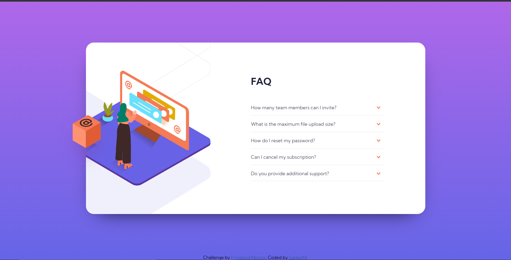

# Frontend Mentor - FAQ accordion card solution

This is a solution to the [FAQ accordion card challenge on Frontend Mentor](https://www.frontendmentor.io/challenges/faq-accordion-card-XlyjD0Oam). Frontend Mentor challenges help you improve your coding skills by building realistic projects. 

## Table of contents

- [Overview](#overview)
  - [The challenge](#the-challenge)
  - [Screenshot](#screenshot)
  - [Links](#links)
- [My process](#my-process)
  - [Built with](#built-with)
  - [What I learned](#what-i-learned)
- [Author](#author)

## Overview

### The challenge

Users should be able to:

- View the optimal layout for the component depending on their device's screen size
- See hover states for all interactive elements on the page
- Hide/Show the answer to a question when the question is clicked

### Screenshot

### Links

- Solution URL: [Add solution URL here](https://github.com/SanketMuthal/FAQ-accordion-card-solution)
- Live Site URL: [Add live site URL here](https://sanketmuthal.github.io/FAQ-accordion-card-solution/)

## My process

### Built with

- HTML5
- CSS3
- JavaScript

### What I learned

I enhanced my JavaScript Knowledge and improved my logic building capacity. Also I learned few more CSS concepts used in the project.

## Author

- Frontend Mentor - [@SanketMuthal](https://www.frontendmentor.io/profile/SanketMuthal)
